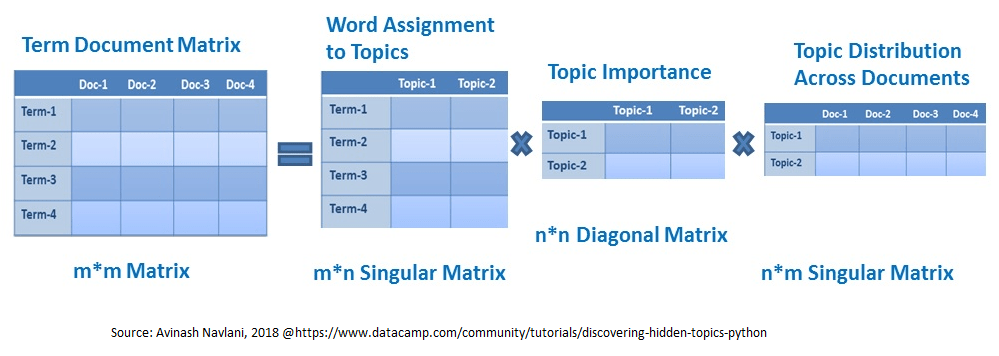

# TLDR Summarizer
This project focuses on the following question:
> Given a document written in English, can a combination of TF-IDF term scores and concept/sentence priority
scores generated by Latent Semantic Analysis be used for sentence importance estimation and summarization of the input
document?

## Example

Please refer to the [example](https://github.com/holuond/uni-4iz470-nlp-tldr-summarizer/tree/develop/example) folder, which contains a full example consisting of an input document, the generated summary and the associated application log with relevant execution details.

## Design

The application consists of a primary pipeline that generates a summary from an input text,
and a secondary pipeline for document preprocessing and IDF model training.

<link type="text/css" rel="stylesheet" href="custom.css" />

graph TD
    A[Document to Summarize] --> B
    style A stroke-width:4px
    subgraph Pre-process Document
        B([Sentencer]) --> C([Tokenizer]) --> D([Normalizer]) -->
        E([StopWordsRemover]) --> F([Lemmatizer]) --> G([CountVectorizer])
    end
    subgraph S1 [Train English IDF Model]
        style S1 fill:#ffffff,stroke:#333,stroke-width:1px
        I["Large English Text Corpus (millions of words)"] --> B2
        subgraph Pre-process Corpus
            B2([Sentencer]) --> C2([Tokenizer]) --> D2([Normalizer]) -->
            E2([StopWordsRemover]) --> F2([Lemmatizer]) --> G2([CountVectorizer])
        end
    G2 --> J[English Vocabulary IDF Model]
    end
J -.- K([TF-IDF])
G --> K
K --> L[Lemma x Sentence Matrix]
L --> M([LSA])
M -.- N1[Lemma x Concept Matrix]
M -.- N2[Concept x Sentence Matrix]
M -.- N3[Concept Importance Matrix]
M --> O(["Score Doc. Sentences based on f(LSA, TF-IDF)"])
O --> P[Top N Sentences as Doc. Summary]
style P stroke-width:4px

First, the input document goes through the following transformations:
1. Document cleaning
1. Sentence boundaries identification
1. Tokenizer
1. Normalizer
1. Stop words remover
1. Lemmatizer
1. Count vectorizer
1. IDF scoring

After these Spark ML lib/Spark NLP annotations a [lemma x sentence] matrix is constructed with each value being the tf-idf
score of the given lemma -> sentence pair.

This matrix is the input for Latent Semantic Analysis. It is decomposed to matrices U [lemma x concept], Vt [concept x sentence] and a diagonal matrix S
which can be transformed to a vector of concept importance scores. The full square S matrix is used, no dimension reduction is employed.

Finally, the original sentences are scored and ordered based on the Vt [concept x sentence] matrix and the ordered concept importance vector. 
Longer sentences are penalized by dividing the score with the lemma count in the given sentence.
Only a number of the original sentences is kept depending on the specified reduction ratio. The selected sentences are ordered
as per their original order and concatenated into the output summary.
The pipeline also outputs important keywords as a secondary product, although these are calculated only based on the tf-idf scores, not the latent concepts from LSA.

## Technology overview
Language:
- [Scala](https://scala-lang.org/)

Build management:
- [Gradle](https://gradle.org/)

Core framework and engine:
- [Apache Spark](https://spark.apache.org/)

Core libraries:
- [Apache Spark ML Lib](https://spark.apache.org/docs/2.4.7/ml-guide.html)
- [Spark NLP](https://nlp.johnsnowlabs.com/) (John Snow Labs)

## IDF Model

Free samples from 3 English text corpora are used as training data for the IDF model:
- [iWeb](https://www.english-corpora.org/iweb/)
- [Corpus of Contemporary American English (COCA)](https://www.english-corpora.org/coca/)
- [The Wikipedia Corpus](https://www.english-corpora.org/wiki/)

The training corpus thus consists of more than 150 million words and a vocabulary of 262144 unique lemmas.

## Evaluation

As there is no clear ideal solution in text summarization, the proposed evaluation method is statistical comparison
with outputs from a number of widely used summarization tools aggregated into an intersection of the most influential sentences.
For the purposes of this work, a substantial simplification is made by substituting this consensus sentence set with
just the results provided by the [SMMRY](https://smmry.com) application (which powers the [autotldr Reddit bot](http://autotldr.io)).

A method using a one-sided hypergeometric/Fisher's exact test is proposed, the null hypothesis being that TLDR Summarizer
only achieves a success rate equal to random sampling, with the one-sided alternative suggesting that the tool achieves
statistically significant improvement over a random selection of sentences.

A number of qualitatively heterogeneous documents are to be tested and simultaneously evaluated using the Holm-Bonferroni method.

The extent of this work does not include a full evaluation of the pipeline.
A number of news articles with around 5000 characters were tested in the development phase and
the results were manually examined and subjectively assessed as showing good potential.

_Out of curiosity, just a small sample of 3 news articles from CBS were subjected to the hypergeometric test described above:_
- [Biden unveils record $6 trillion budget for 2022 (Watson a Cook 2021)](https://www.cbsnews.com/news/biden-budget-6-trillion-proposal-2022/): p-value = 0.1168 (see the summary and associated pipeline logs in the [example](https://github.com/holuond/uni-4iz470-nlp-tldr-summarizer/tree/develop/example) folder)
- [French President Emmanuel Macron slapped in the face while visiting small town](https://www.cbsnews.com/news/emmanuel-macron-slapped-face-france/): p-value = 0.0264
- [Facebook bans Trump for at least two years](https://www.cbsnews.com/news/trump-facebook-suspension-two-years/): p-value = 0.0656

## Discussion

Several improvements and directions for future work are suggested:
- Experiment with and evaluate populating the input LSA matrix with different values. Right now tf-idf is used for the cell values, other options include using a function of tf-idf (e.g. a logarithm).
- Experiment with and evaluate non-linear penalization of short vs long sentences.
- Leverage the LSA results when generating keywords (right now only tf-idf is used for keyword selection).
- Increase the quantity and heterogeneity of the training corpus for the IDF model.
- Investigate the U matrix - observe what groups of lemmas influence the most significant latent concepts.
- Evaluate pipeline performance on a multi-node cluster.
- Find a sentence splitter that has better performance when it comes to quoted sentences.
- Evaluate the success of the tool using numerous heterogeneous input documents while comparing the results to a large consensus dataset acquired from multiple widely used summarization tools
